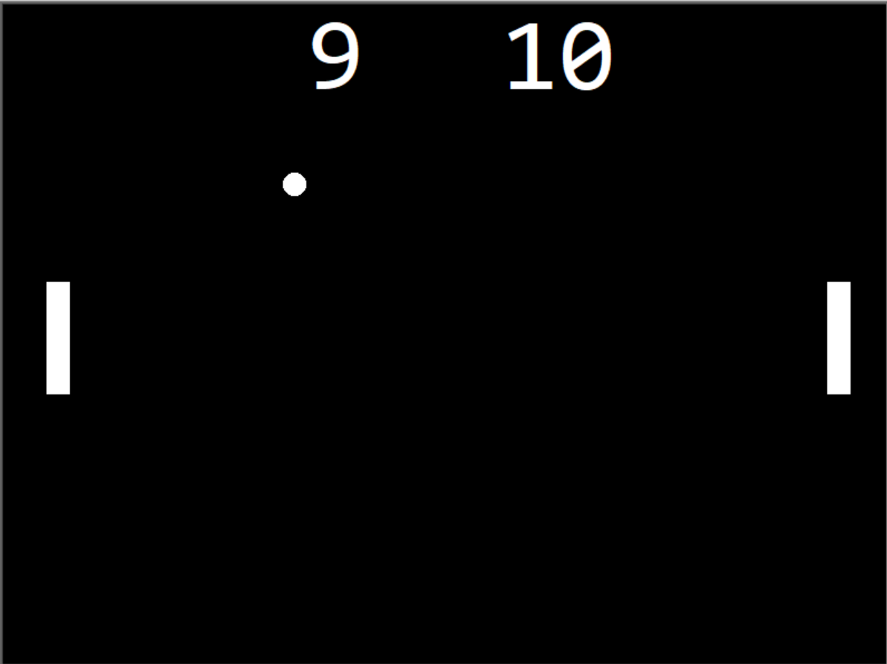

#  Pong Game (Python Turtle)
A classic Pong game built in Python using the Turtle graphics module.
This project was created to demonstrate object-oriented programming (OOP), real-time input handling, and fundamental game development concepts.
##  Features
-	Two player controls (W/S and ↑/↓)
-	Smooth and continuous pad movement (via key press and key release)
-	Ball speed increases after each paddle hit
-	Scoreboard with real-time updates
-	Modular design with multiple .py files (main.py, ball.py, paddle.py, scoreboard.py)
## Controls
Left paddle – Move up (W), Move down (S)
Right paddle – Move up (↑), Move down (↓)
## How to Run
1. Clone this repository:  
   ```bash
   git clone https://github.com/AdamSimak/pong-python
   cd Pong-Game
2. Run the game
   ```bash
   python main.py
## Project Structure
pong-game/
-	main.py (Game loop and initializing screen and keys)
-	ball.py (Ball class – movement, bouncing, speed, collision handling)
-	paddle.py (Paddle class – controls, movement, flashing)
-	scoreboard.py (Scoreboard class – score tracking and display)
-	README.md (Project documentation)
## Purpose & Skills Demonstrated
I created this project to practice object-oriented programming, real-time input handling, and game development fundamentals in Python, and to apply my skills in a real-world project.
Through this project, I gained experience with:
-	Python OOP
-	Modular code structure
-	Collision detection
-	Real-time keyboard input handling
-	Game loop design
-	Debugging unexpected behavior
## Screenshot
 

## Author
Developed by Adam Šimák

